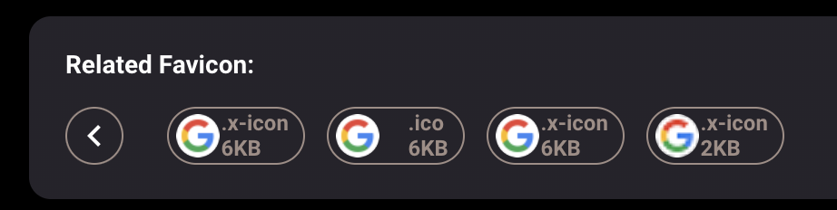

# FAQ
<a href="#general">General</a> •
<a href="#subscription-and-payment">Subscription and payment</a> •
<a href="#favicon-search">Favicon Search</a> •
<a href="#domain-related">Domain Related</a> •


## General

### 1. Do i have to register before search?
We do recommend users to login with Google account, this services ensures the security of user passwords and user privacy.
However you could still explore our site without sign in.

### 2.Why there is no corresponding search result for the IP/domain/port/etc. I searched for?
Please browse the returned error message or switch the date filter. Hunter displays our data results of the past month by default.
If you still can't find satisfactory results, please feel free to comment on our github space.

## Subscription and payment
### 1. Can i pay with my credit card?
Currently all payments need to go through Paypal channel, Paypal accepts major credit cards and debit cards.
If you still facing any payment issue please contact us through **[Email](hunter.how00@gmail.com)**

### 2. How long does it take for a subscription to be activated after a successful payment？
After your successful payment, hunter.how will send a successful subscription message and the validity period to the email address associated with your Google account.

### 3.Can I repurchase a subscription plan when my data quota is used up within 30days?
Single subscription plan only supports a single purchase within 30days. If you need to have a higher data quota, please upgrade your current subscription plan or contact our sales team to customize an exclusive data quota for you.

## Favicon Search

### 1.How to generate a favicon hash?
For favicon > 256KB Hunter only take head 256KB of the favicon
Hunter use md5 hash for all favicons
Favicon md5's generating mechanism:
```
import hashlib
def favicon_hash(favicon_path):
        print(hashlib.md5(open(favicon_path,'rb').read()).hexdigest())
```
### 2. How to search with favicon?
There are two methods you could try out through hunter platfom:
* Use query favicon_hash="md5 value" to search for internet services that uses this favicon
* Click on the favicon button on your result list, we will search on that target favicon hash straught away which reduce the trouble of md5 conversion
Here is the example: 


### 3. What is related favicon?
Hunter will recommend similar favicons to your favicon query results. These favicon commonly hard to differentiate with eyes.
This recommendation base on the appearance of favicon you have searched, our algorithm will base on your input favicon appearance to provide you with more possible results.

  

## Domain Related 

### 1. How can I search for subdomains of a given domain?

domain.suffix="google.com"

[https://hunter.how/list?searchValue=domain.suffix%3D%22google.com%22&timestamp=1679566378561](domain.suffix="google.com")

### 2. How to exclude a domain, web title etc what should i write?

Not equal to: "!=" 
Not exactly equal to: "!==" 

domain="google.com"&&domain.suffix!=="google.com"

https://hunter.how/list?searchValue=domain%3D%22google.com%22%26%26domain.suffix%21%3D%3D%22google.com%22

web.title="Login"&&web.title!="Webmail"

https://hunter.how/list?searchValue=web.title%3D%22Login%22%26%26web.title%21%3D%22Webmail%22
